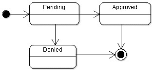

# Employee Reimbursment System (ERS)

## Notes To Sir Timothy

Greetings Tim, 

I managed to put my stuff up on Ec2: http://www.projectone.com.s3-website-us-west-2.amazonaws.com/

##OutOfDateInfo
But, I can't get it fully CORS compatible, and I think it has something to deal with S3.  without the use of a firefox extension: https://addons.mozilla.org/en-US/firefox/addon/cors-everywhere/.

##Update
Fixed cors issue during break: All s3 requests orignate from : s3-us-west-2.amazonaws.com; adding this to cors filter allowed app to be usable without extensions! :D 
I do not know if it is compatible with chrome. I did test with firefox both on phone and laptop, and I had no issues. On my phone, it did not work on Chrome. You could login and traverse through the site, from what I could tell. I did not , however, check/uncheck the settings covered in training for firefox in my mobile browser. In any case, should be available on FF, abd probably some other browsers as well.

You might need to reload it twice to get the best font ever since I think the page loads before the google fonts do sometimes.

If you install and activate the plug in, you can test it our yourself. There's two users employee and financemanager, and both of them share the same password as their respective usernames.

The app is connected to an RDS db instance. 

And, tomcat is running inside of docker on ec2 on port 8088.

The tomcat cors filter is also configured for S3 and the html files are also configured for S3. If you'd like to test these on your local machine, let me know and I can just change the cors filter setting as well as some javascript in the front end and you'll be good to go. 

Lastly, my service layer highly depends on HttpServletRequest and HttpServletResponse due to an interface I used. I could not test this in any meaningful way, as I would need to do what tomcat has done and implement these two abstract classes. That said I did run quite a few tests on the things I could, and I did reach over 70% on my repo layer which was the next best thing. All my authentication logic is also completing using HttpServletRequest/HttpServlet responses or Filters for session authentication which also use the same classes.

## Executive Summary
The Expense Reimbursement System (ERS) will manage the process of reimbursing employees for expenses incurred while on company time. All employees in the company can login and submit requests for reimbursement and view their past tickets and pending requests. Finance managers can log in and view all reimbursement requests and past history for all employees in the company. Finance managers are authorized to approve and deny requests for expense reimbursement.

**State-chart Diagram (Reimbursement Statuses)** 

**Reimbursement Types**

Employees must select the type of reimbursement as: LODGING, TRAVEL, FOOD, or OTHER.

**Logical Model**

**Physical Model**

**Use Case Diagram**

**Activity Diagram**

## Technical Requirements

The back-end system shall use JDBC to connect to a Postgres database. The application shall deploy onto a Tomcat Server. The middle tier shall use Servlet technology for dynamic Web application development. The front-end view shall use HTML/CSS/JavaScript to make an application that can call server-side components in a generally RESTful manner. Passwords shall be encrypted in Java and securely stored in the database. The middle tier shall follow proper layered architecture, have reasonable (~70%) test coverage of the service layer, and implement log4j for appropriate logging. Webpages shall be styled to be functional and readable. 

**Stretch Goals:**
* Replace JDBC with Hibernate to manage the database connection.
* Users can upload a document or image of their receipt when submitting reimbursements which can stored in the database and reviewed by a financial manager.
* Postgres Database shall be hosted remotely on an AWS RDS. 
* Java application shall be hosted remotely on an EC2.
* Static files (webpages) shall be hosted on an S3 bucket. 
